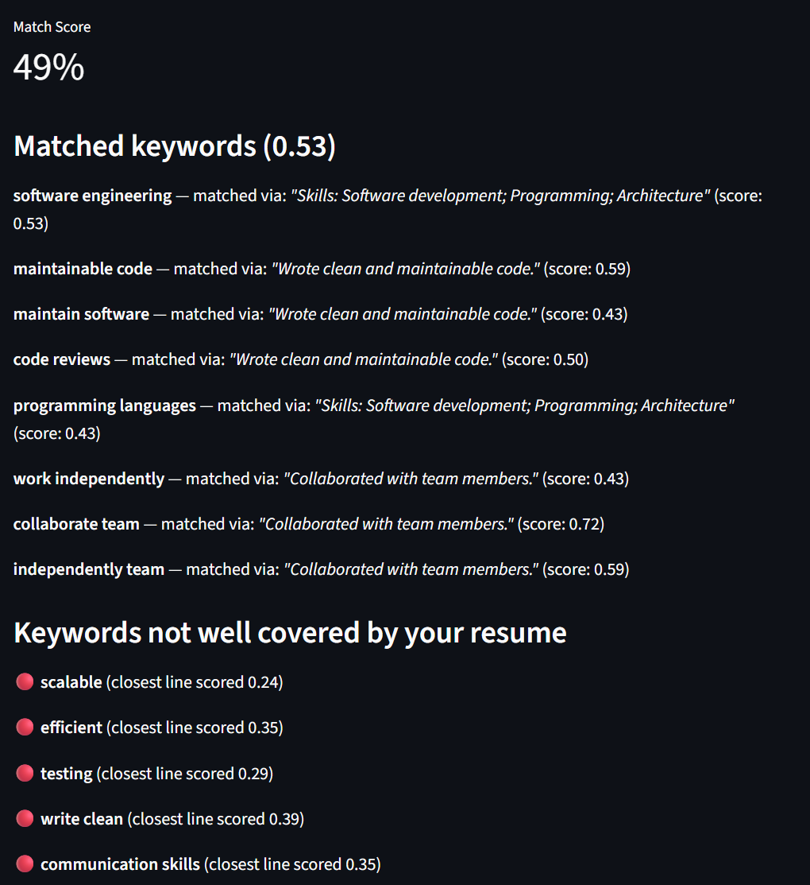

# resumatch

A tool that scores how well a resume matches a job description using semantic similarity and shows exactly which requirements are covered and which are missing.

**Live demo:** https://try-resumatch.streamlit.app/



## How it works

1. **Extracts key requirements** from a job description using KeyBERT, splitting the text by clause first so keyword phrases can't accidentally merge across unrelated ideas
2. **Splits the resume into individual, focused chunks** — first into bullet points (using bullet characters as the boundary signal when present, with a fallback to one-line-per-chunk for docx paragraphs that don't preserve literal bullet glyphs), then further into individual sentences using spaCy's sentence segmentation, so a single long, multi-sentence bullet doesn't get treated as one diluted blob
3. **For each requirement, finds the resume's best-matching chunk** using sentence embeddings and cosine similarity
4. **Weights the overall score by how important each requirement was** to the job posting, so missing a central requirement counts more than missing a minor one
5. **Filters out noise** before it reaches the user: generic filler terms, near-duplicate/substring keywords, and low-relevance extraction artifacts are all cleaned up before results are shown

## Tech stack

Python, Streamlit, sentence-transformers, KeyBERT, spaCy, scikit-learn, pdfplumber, python-docx, pytest

## Project structure

```
resumatch/
  app.py                 # Streamlit UI
  matcher/
    embeddings.py         # sentence-transformer model, similarity scoring, resume chunking
    keywords.py            # keyword extraction, semantic matching, overall score calculation
    parser.py              # PDF/docx text extraction
  tests/
```

## Known limitations

- Keyword extraction can still surface job-posting boilerplate as low-relevance "requirements," since that text is grammatically valid even though it isn't a real skill requirement
- Matching quality depends on the sentence-transformer model's ability to represent domain-specific technical terms